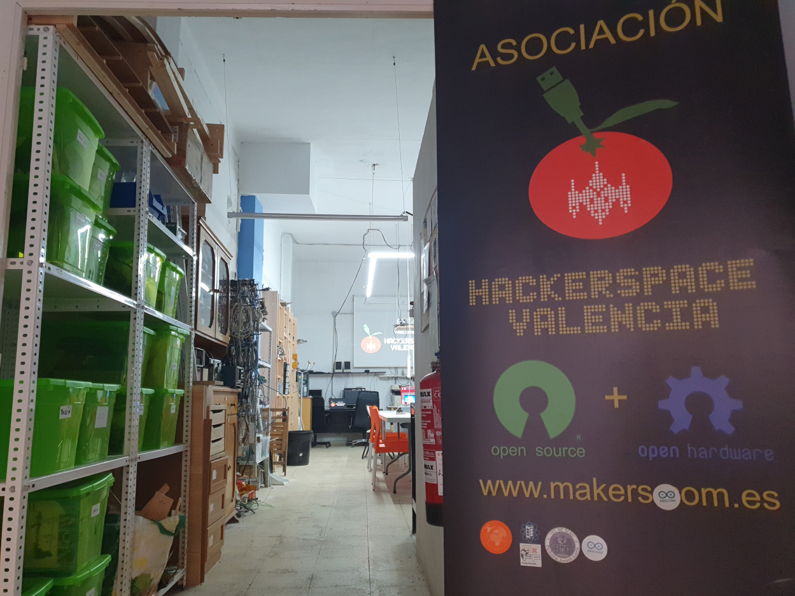
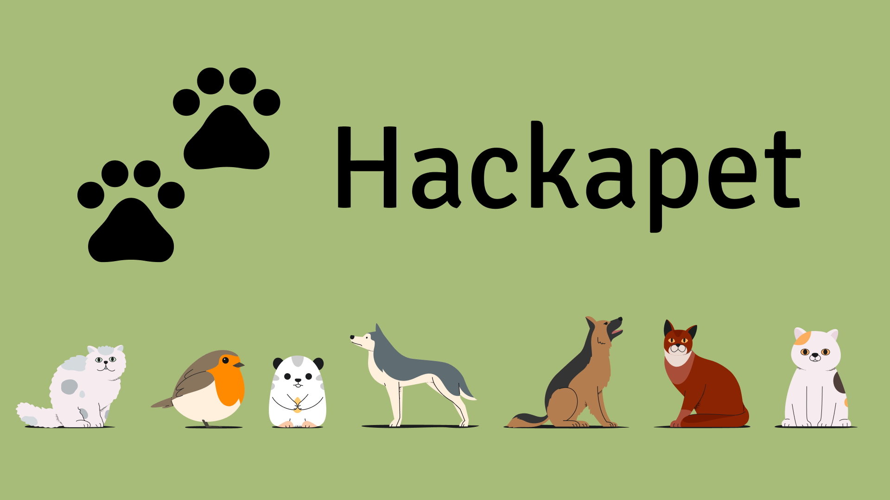

# Copia de estas diapositivas

Puedes encontrar una copia de estas diapositivas en el siguiente enlace:

[https://github.com/hackapet-project/org-slides](https://github.com/hackapet-project/org-slides)

{width=0.5\textwidth}

---

# ¿Qué veremos en esta introducción?

1. ¿Qué es hackapet? ¿Por qué lo hacemos?
2. Introducción breve.
3. Las fases.
4. Colaboración y comunicación con las protectoras.
5. Cómo nos organizaremos. El modelo híbrido.
6. Cómo va a funcionar cada plataforma.
7. Debate sobre la organización y preguntas.

---

---

# ¿Qué es Hackapet? ¿Por qué lo hacemos?

---
