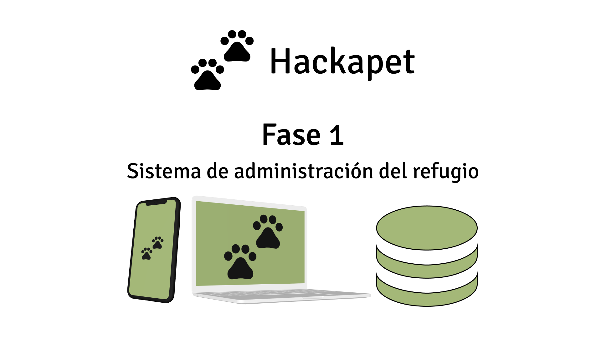
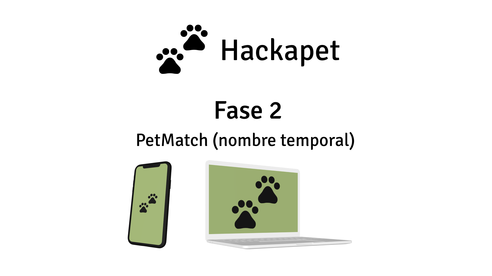
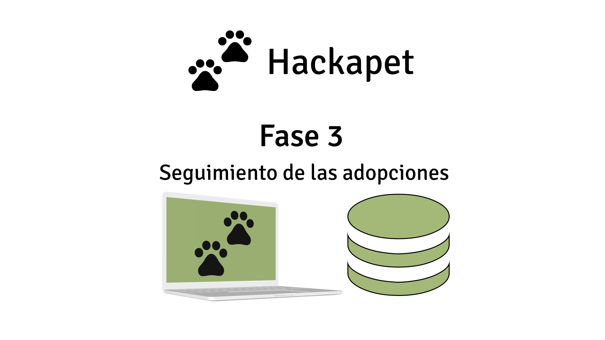

# Copia de estas diapositivas

Puedes encontrar una copia de estas diapositivas en el siguiente enlace:

[https://github.com/hackapet-project/org-slides](https://github.com/hackapet-project/org-slides)

{width=0.5\textwidth}

---

# ¿Qué veremos en esta introducción?

1. ¿Qué es hackapet? ¿Por qué lo hacemos?
2. Introducción breve.
3. Las fases.
4. Colaboración y comunicación con las protectoras.
5. Cómo nos organizaremos. El modelo híbrido.
6. Cómo va a funcionar cada plataforma.
7. Debate sobre la organización y preguntas.

---

{width=1\textwidth}

---

# ¿Qué es Hackapet? ¿Por qué lo hacemos?

{width=1\textwidth}

---

# Introducción breve

## Hackapet es
Un proyecto **sin ánimo de lucro y de código abierto** que desarrolla herramientas digitales para **optimizar la gestión en refugios de animales y facilitar las adopciones.**

- Somos voluntarios.
- Ganamos experiencia y podemos ponerlo en nuestro portfolio.
- Colaboramos con una buena causa.
- Aprendemos entre nosotros y de gente con mucha más experiencia.
- Trabajamos en equipo.

---

# Las fases.

## El proyecto se divide en 3 fases
* Se harán por orden de dificultad y en función de cuanta gente seamos.
* La segunda fase se hará al final ya que es la más importante y grande.
* Habrán deadlines para cumplir, pero para los P.O.

---

{width=1\textwidth}

---

{width=1\textwidth}

---

{width=1\textwidth}

---