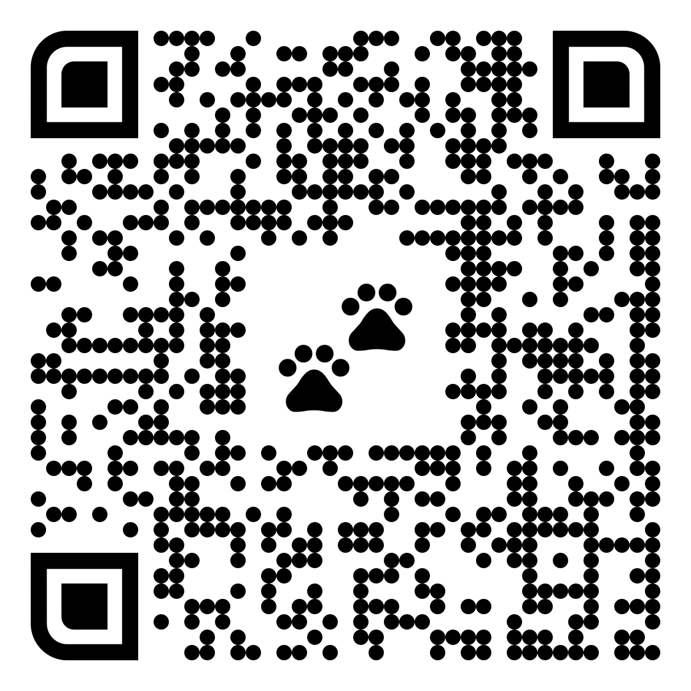
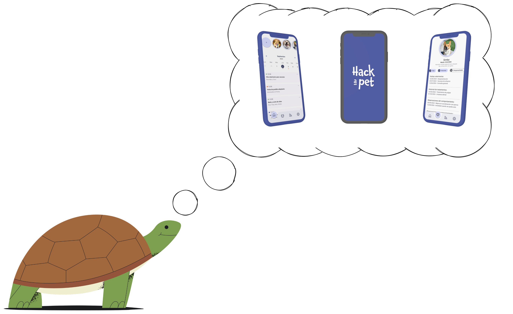

# Copia de estas diapositivas

Puedes encontrar una copia de estas diapositivas en el siguiente enlace:

[https://github.com/hackapet-project/org-slides](https://github.com/hackapet-project/org-slides)

{width=0.5\textwidth}

---

# ¿Cuál es el propósito de esta presentación?

1. Nuestros propósitos de año nuevo. Nuevas metas.
2. Cómo los conseguiremos.
3. ¿Cómo está actualmente el proyecto?
4. Colaboración y comunicación con las protectoras.
5. Abrirnos al público.
6. Organización interna.
7. Debate sobre la organización y preguntas.

---

# What are my new year resolutions?

- My M1 Mac has 3546x2234, however I have some scaling setup.
- My desktop 1920x1080. The classic.

---

# Própositos de Hackapet de año nuevo.

{width=1\textwidth}

---

# Hackapet en 2025 (y 2026) 

- Tenemos PetSync desplegado en Beta en las protectoras con las que colaboramos. **(Antes de verano)**
- Estamos puliendo bugs de PetSync y comenzando el trabajo de la siguiente fase ^^ **(Antes de septiembre)**
- Colaboramos con más protectoras y santuarios de forma cercana. Unas 5. Junto con las que ya colaboramos. **(Antes de octubre)**
- Tenemos nuestro propio espacio físico. **(Antes de mitad de año)**
- Tenemos nuestra propia entidad legal, Asociación Sin Ánimo de lucro - **(Antes del final de febrero)**
- Damos charlas en Conferencias de OpenSource a nivel nacional e internacional **(Cuando queráis, ¿Voluntari@s?)**
- Ofrecemos salarios a diseñador@s, y desarrollador@s que estén a tiempo parcial. **2026**

---

# ¿Cómo lo conseguimos?

## ¡Sólo seguid siendo así de geniales! ^^

Habéis hecho un trabajo magnífico el año pasado, este año si seguimos así podremos consegir los resultados de arriba, ¡y más!

La estrategia en cada equipo la veremos en detalle más adelante, pero como clave: **Constancia.**

---

# Un año de Hackapet.

Hackapet cumplió un año oficialmente el mes pasado. En este año:

- Hemos pasado de 3 personas a 9 habituales, más simpatizantes.
- Hemos dado una charla en Las Naves.
- Colaboramos con dos protectoras de Torrente.
- Hemos empezado el proyecto y va encaminado.
- No nos podemos confiar.

---

## ¡Vamos a por ello!

---

# Reuniones con protectoras

- Necesitamos encontrar protectoras y santuarios con los que colaborar, máximo 5. (A partir de Febrero)
- Vamos a reunirnos una vez a la semana con las protectoras para actualizarles de los progresos y ver sus necesidades.
- Vamos a reunir toda la documentación que hemos recogido de esas reuniones y ponerlas en un Knowledge Management Tool, de forma pública, solo información de las necesidades. No actas de reunión o información sensible.

---

# Abrirnos al público.

- 1 de Febrero charla en el Hackerspace.
- Más charlas en diferentes eventos.
- Mayor actividad en redes sociales.
- Mejorar la web, LinkedIn, etc.
- Boca a boca.

---

# Organización interna

- Org
    - Noticia agridulce.
- Diseño
    - Web rediseño.
    - App.
    - Template para protectoras, de web.
- Frontend
    - Desarrollo de Template.
    - Necesidad de Team Lead.
- Backend
    - Desarrollo del Backend.
    - Necesidad de Team Lead.
- iOS
    - Desarrollo de iOS.
- Android
    - Eugeni es el Team Lead.
    - Está todo muy avanzado.

---

# Debate sobre la organización.

Aquí hablamos de temas propuestos por vosotros de forma oficial u anónima.

1. I.D.: Podríamos en un futuro hacer que el sistema del backend sea federado. Obviamente, tenemos que centrarnos en que funcione primero, pero no perder de vista esto, así es mucho más interoperable.
2. I.D.: Habría que ir pensando en buscar conferencias donde dar charlas o al menos ir. #repre100.

